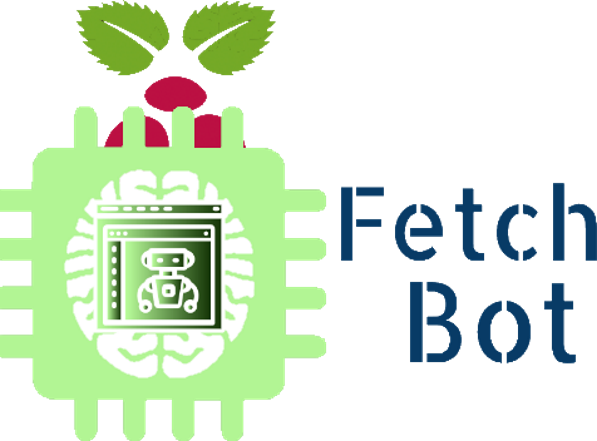

[](https://github.com/cshadd/fetch-bot/)

[](https://github.com/cshadd/fetch-bot/releases)
[](LICENSE)
[](https://www.travis-ci.org/cshadd/fetch-bot)

# Fetch Bot
AI based robot with image processing.

## Getting Started

### Hardware Dependencies
* Setup:
    - x1 Computer
    - x1 Ethernet Cable
    - x1 Tool Kit
    - x1 Pack of Glue/Tape/Screws
* Recommended:
    - x1 Raspberry Pi 3 Model B
    - x1 JBtek Raspberry Pi Micro USB Cable with ON / OFF Switch - Easy Start / Reboot
    - x1 A-Male to B-Male USB
    - x1 Micro USB
    - x1 KUNCAN DC 5V to DC 12V Converter Step Up Voltage Converter 5ft Am to DC 5.5 x 2.1mm
    - x1 Logitech HD Webcam C525, Portable HD 720p Video Calling with Autofocus
    - x1 Male to Male HDMI Cable
    - x1 Elecrow RPA05010R HDMI 5-Inch 800x480 TFT LCD Display with Touch Screen Monitor for Raspberry Pi B+/2B/3B
    - x2 Adafruit Stepper Motor NEMA17 12V 350mA
    - x2 Adafruit TB6612 1.2A DC/Stepper Motor Driver Breakout Board
    - x2 Mounting Bracket for Nema 17 Stepper Motor (Geared Stepper) Hobby CNC/3D Printer
    - x2 RB-Nex-75 60mm Aluminum Omni Wheel
    - x2 5mm Aluminum Mounting Hub
    - x1 Standard Wheel Caster - Swivel
    - x1 Arduino Uno
    - x1 Keywish 5PCS HC-SR04 Ultrasonic Module Kit Distance Sensor for Arduino UNO, Mega, R3, Mega 2560, Nano, Duemilanove, Raspberry Pi 3
    - x1 Non-Soldering Breadboard
    - x1 Non-Soldering Jump Wires
    - x1 Internet Router
    - x1 Robot Chassis
    - x1 15000mAh Dual USB Output and 2A Input Battery Pack
* Optional:
    - x1 Raspberry Pi Case Kit

### Hardware Assembly
Great care is needed to assemble this robot. We specifically chose these parts for our robot but it is up to you to decide which ones you will use.
```
1. Assemble the chassis with the parts, we recommend using the parts listed and we 3d printed our design.
Make sure the wheels are balanced.
2. Connect the stepper motors and the ultrasonic sensor to the Arduino.
The ports are listed in <PROJECT DIRECTORY>/arduino-slave-processor/FetchBot/FetchBot.ino.
Adafruit has tutorials online for the stepper motor including the correct way to power it.
The stepper motor will need a separate source so we used the transformer to convert the 5V (2A port) battery to 12V for the motor).
3. Connect the Arduino directly to the Raspberry Pi.
4. Connect the monitor to the Raspberry Pi.
5. Connect the webcam to the Raspberry Pi.
6. Connect the Raspberry Pi to the 5V (1A port) battery.
7. Set up the router.
8. Configure hardware.
```

Full assembly is beyond the scope of this project.

### Why Raspberry Pi and Arduino Uno?
Let's face it. In our day and age of the 21st century, we want lightweight mobile systems for robots. The Pi and Uno is perfect for it. We cannot stress enough about the power of the Pi and Uno. The features on the Pi contains preinstalled software such as ``git``.It is easy to setup and use as it is virtually a computer itself. We built this robot specifically on the Pi and Uno but made it as modular as possible to accommodate other systems. If you want to use a full tower as a robot brain, go ahead. But the Pi and Uno is much simpler. Proceeding forward, we will be specifically talking about the Pi and Uno unless otherwise. The system and Bash command lines will rely on the Pi.

### Software Dependencies
* Recommended (Raspberry Pi):
    - OS: Raspbian Stretch or higher
    - Software:
        - Apache HTTP Server 2.4.25 or higher
        - Apache Maven 3.5.3 or higher
        - ArduinoJson 5.13.1 or higher
        - Basic Linux Software (``apt-get``, ``bash``, ``git``, ``wget``, etc.)
        - Chromium Browser
        - Java SE Development Kit 8.0 or higher
        - Java SE Runtime Environment 8.0 or higher
        - OpenCV 3.4.1
        - PHP 7.0.27 or higher
        - VNC Server
    - Packaged Software (apt-get):
        - arduino-core
        - arduino-mk
        - unclutter
* Optional (Computer):
    - OS: Any
    - Software:
        - Arduino IDE 1.8.5 or higher
        - Eclipse Oxygen or higher
        - Visual Studio 2017 or higher

### IDEs
You may use any IDE of your choice to edit project files. We have included files for importing the project into Eclipse Oxygen or higher and Visual Studio 2017 or higher. These would be ``.project`` and ``fetch-bot.sln`` respectively.

## Installing The Project Software
Before installing this project, you must make sure that you have installed all the dependencies necessary and have assembled the hardware correctly.

### Easy Install
Execute
```bash
cd <PROJECT DIRECTORY>
./bash-install.sh
```
in a Bash terminal.

The main files will be located in ``~/bin``.

Web interface files will be located in ``<LOCATION OF APACHE HTTP SERVER FOLDER>/FetchBot``.

### Building From Source (Custom Build)
Make sure you uninstall the project if you have installed it before.

You need to first upload the Arduino Sketch to the Arduino. You may change the Arduino code before you upload it.

Execute
```bash
cd <PROJECT DIRECTORY>
cd ./src/arduino-slave-processor/FetchBot
rm -f -r ./build-uno
make upload
```
in a Bash terminal.

You should make sure that the directory is clean.

Execute
```bash
cd <PROJECT DIRECTORY>
mvn clean
```
in a Bash terminal.

You may now make any changes to the Java project that you desire. Once you are done it is time to compile the project.

Execute
```bash
mvn compile
```
in a Bash terminal.

For the web interface you may make any changes you desire.

Proceed to the next section to install the build.

### Installing From Custom Build
You will package the main Java code into a jar.

Execute
```bash
mvn package
```
in a Bash terminal.

Then copy the needed directories and files to the appropriate locations.

Execute
```bash
cd <PROJECT DIRECTORY>
cp -r ./target/libs <DESIRED LOCATION OF PROGRAM>
cp ./target/fetch-bot-vx.x.x.jar <DESIRED LOCATION OF PROGRAM>/fetch-bot-vx.x.x.jar
cp ./src/bash-start.sh <DESIRED LOCATION OF PROGRAM>/StartFetchBot.sh
sudo cp -R ./src/www <LOCATION OF APACHE HTTP SERVER FOLDER>/FetchBot
```
in a Bash terminal.

Then you need to set permissions and ownership.

Execute
```bash
sudo chmod 764 <DESIRED LOCATION OF PROGRAM>/StartFetchBot.sh
sudo chown -R $USER:www-data <LOCATION OF APACHE HTTP FOLDER>/<DESIRED LOCATION OF WEB INTERFACE>
sudo chmod -R 776 <LOCATION OF APACHE HTTP SERVER FOLDER>/<DESIRED LOCATION OF WEB INTERFACE>
```
in a Bash terminal.

### Training
The project must be trained with a neural network. We use Caffe to train the project.
The folder for the training data is ``<PROJECT DIRECTORY>/src/neural-network/``.
Tutorials on training is beyond the scope of this project.

## Uninstalling The Project Software

### Easy Uninstall
Only do this if you did the Easy Install!

Execute
```bash
cd <PROJECT DIRECTORY>
./bash-uninstall.sh
```
in a Bash terminal.

### Manual Uninstall
Execute
```bash
sudo pkill java
sudo rm -f -r <LOCATION OF APACHE HTTP SERVER FOLDER>/<DESIRED LOCATION OF WEB INTERFACE>
find <CURRENT LOCATION OF PROGRAM> -name 'fetch-bot*.jar' -exec rm -f {} \;
rm -f -r <CURRENT LOCATION OF PROGRAM>/libs/fetch-bot
rm -f <CURRENT LOCATION OF PROGRAM>/StartFetchBot.sh
```
in a Bash terminal.

## Usage
To run, execute
```bash
cd <CURRENT LOCATION OF PROGRAM>
./StartFetchBot.sh
```
in a Bash terminal.

To control and terminate the application, you must use the web interface. The address to the web interface depends on your Apache configuration. Normally it would just be http://localhost/FetchBot.

The OpenCV Controller Terminal Window is located at the VNC server :1.

## Web Page
https://cshadd.github.io/fetch-bot/

## Contributing
See [here](CONTRIBUTING.md).

## Versioning
We use [SemVer](http://semver.org/) for versioning. For the versions avalible, see the [tags on this repository](https://github.com/cshadd/fetch-bot/tags).

## Owners/Authors/Developers/Contributors
* Project Owner, Main Author, Lead Developer - [Christian Shadd](https://github.com/cshadd)
* Author, Hardware Developer, Documentation - [Maria Verna Aquino](https://github.com/anrev09)
* Author, Hardware Developer - [Thanh Vu](https://github.com/Vu-Thanh)
* Author, Hardware Developer, Software Developer - [Joseph Damian](https://github.com/walterk4)
* Author, Software Developer - [Giovanni Orozco](https://github.com/gio-oro)

And the [contributers](https://github.com/cshadd/fetch-bot/graphs/contributors).

## License
See [here](LICENSE).

## Development Standards
See [here](/docs/development-standards/DevelopmentStandards.pdf).

## Software Requirements Specification
See [here](/docs/software-requirements-specification/SoftwareRequirementsSpecification.pdf).

## Acknowledgements
* [Adafruit](https://www.adafruit.com/)
* [Apache](https://www.apache.org/)
* [Arduino](https://www.arduino.cc/)
* [Caffe](http://caffe.berkeleyvision.org/)
* [Eclipse](https://www.eclipse.org/)
* [Ed's Blog](http://pblog.ebaker.me.uk/)
* [JitPack](https://www.jitpack.io/)
* [Microsoft](https://www.microsoft.com/)
* [OpenCV](https://www.opencv.org/)
* [Oracle](https://www.oracle.com/)
* [Raspberry Pi](https://www.raspberrypi.org/)
* [The PHP Group](https://php.net/)
* [The Pi4J Project](http://pi4j.com/)
* [Travis CI](https://www.travis-ci.org/)
* [W3Schools](https://www.w3schools.com/)
* [ZenHub](https://www.zenhub.com/)

[](https://www.raspberrypi.org/)

## CSUN AI-JAM 2018 Pre-Alpha Preview

[](https://www.youtube.com/watch?v=jIrqqUIsi4s)
